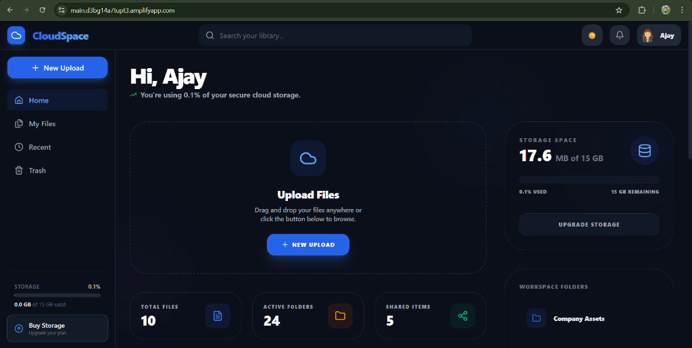
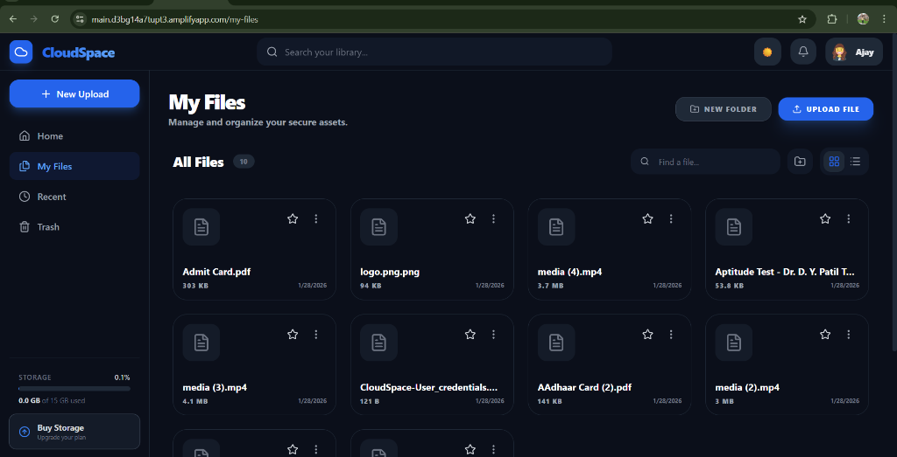
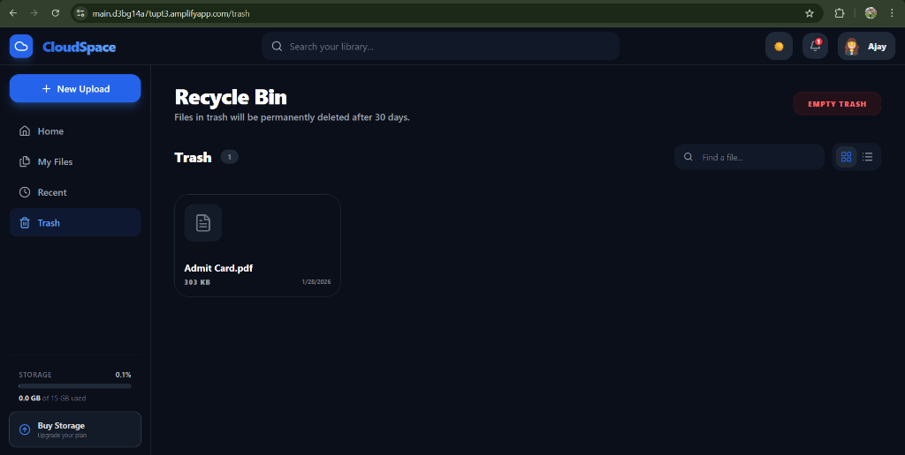
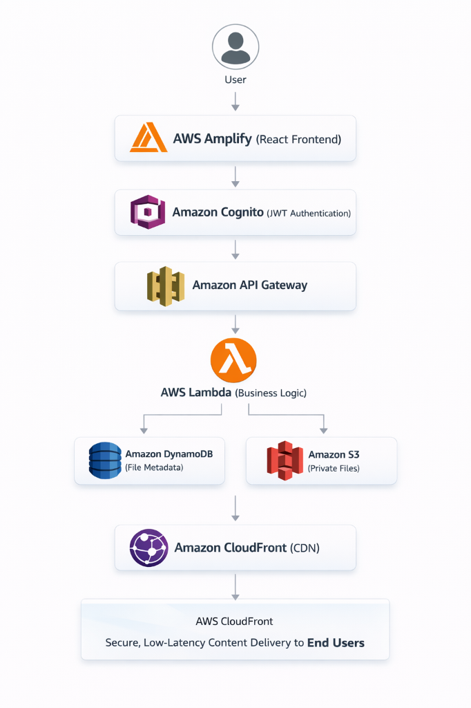

# CloudSpace

A serverless cloud storage platform engineered for secure file management using AWS native services and event-driven architecture.

## Live Demo

https://main.xxxxxxxxxxxx.amplifyapp.com

## Key Features

- Secure Authentication: Identity management and session control via Amazon Cognito.
- Pre-signed URL Integration: Secure file uploads and downloads directly to/from S3, bypassing server bottlenecks.
- Private Object Storage: All files are stored in a non-public S3 bucket with restricted access.
- Metadata Management: Optimized folder structures and file states managed in DynamoDB.
- Trash & Recovery System: Soft-delete mechanism allowing users to restore files.
- Permanent Deletion: Complete removal of assets from both object storage and metadata layers.
- Storage Analytics: Real-time calculation of used vs. available storage capacity.
- Scalable Serverless Backend: Fully managed infrastructure that scales automatically with user demand.

## Project Implementation

### User Dashboard


### File Management


### Recycle Bin (Trash)


## Cloud Architecture Overview



The system follows a cloud-native, serverless architecture designed for high availability and cost-optimization.

Request Flow:
1. User interacts with the React frontend hosted on AWS Amplify.
2. Authentication is handled by Amazon Cognito, which returns a JWT (Jason Web Token).
3. The frontend makes signed requests to Amazon API Gateway, passing the JWT in the Authorization header.
4. API Gateway validates the token and triggers the appropriate AWS Lambda function.
5. Lambda functions perform compute logic, interacting with Amazon DynamoDB for metadata and Amazon S3 for object storage.
6. For downloads, Lambda generates a temporary pre-signed URL, allowing the client to fetch the file directly from S3 via Amazon CloudFront for low-latency delivery.

Serverless was chosen to eliminate server management overhead, provide built-in high availability across multiple Availability Zones, and ensure a pay-as-you-go cost model.

## AWS Services Used

- AWS Amplify: Hosts the React frontend and manages the CI/CD pipeline for automated deployments.
- Amazon Cognito: Provides user pool management, secure sign-in, and JWT-based authorization.
- AWS Lambda: Executes backend logic in a stateless environment using Node.js 24 and ES Modules.
- Amazon API Gateway: Acts as a RESTful entry point, handling request routing, throttling, and security.
- Amazon S3: Serves as the durable object store for all user-uploaded files.
- Amazon DynamoDB: Store for file metadata, folder hierarchies, and user-specific storage configurations.
- Amazon CloudFront: Content Delivery Network (CDN) used to securely serve files from S3 with low latency.
- IAM (Identity and Access Management): Enforces the principle of least privilege across all service-to-service interactions.

## Lambda Functions Overview

- cloudspace-download-file: Retrieves file metadata from DynamoDB and generates a temporary, short-lived S3 GET pre-signed URL.
- cloudspace-generate-upload-url: Validates file requirements and generates an S3 PUT pre-signed URL to allow secure client-side uploads.
- cloudspace-upload-url: Implementation for durable execution or post-upload processing logic.
- cloudspace-list-files: Queries DynamoDB for a user's file list, supporting both active and trashed file views.
- cloudspace-delete-file: Updates the file state to 'isDeleted' in DynamoDB, enabling the trash functionality.
- cloudspace-restore-file: Reverts the 'isDeleted' flag to false, returning the file to the user's active view.
- cloudspace-permanent-delete: Orchestrates the physical removal of the object from S3 and the deletion of its metadata from DynamoDB.
- cloudspace-storage-usage: Aggregates the file sizes for a specific user to report total storage consumption.

## Project Folder Structure

```text
CloudSpace/
├── cloudspace-backend/             # AWS Serverless Backend
│   ├── api-gateway/                # API definitions (OpenAPI/Swagger)
│   ├── env/                        # Environment configurations (dev/prod)
│   ├── iam/                        # IAM execution roles and policies
│   ├── lambdas/                    # Node.js Lambda Functions
│   │   ├── cloudspace-delete-file/
│   │   ├── cloudspace-download-url/
│   │   ├── cloudspace-list-files/
│   │   ├── cloudspace-restore-file/
│   │   ├── cloudspace-storage-usage/
│   │   ├── cloudspace-permanent-delete/
│   │   └── _shared/                # Shared utilities (S3, DynamoDB, CORS)
│   ├── scripts/                    # Deployment and build scripts
│   └── README.md
├── docs/                           # Documentation and images
│   └── images/                     # Architecture and UI screenshots
├── public/                         # Static assets for React
├── src/                            # Frontend Source (React + Vite)
│   ├── api.js                      # Centralized API service layer
│   ├── auth/                       # Cognito auth utilities
│   ├── components/                 # Reusable UI components
│   │   ├── Navbar.jsx
│   │   ├── Sidebar.jsx
│   │   ├── FileCard.jsx
│   │   ├── FilePreview.jsx
│   │   └── StorageBar.jsx
│   ├── context/                    # Theme and Auth context providers
│   ├── layouts/                    # Common page layouts
│   ├── pages/                      # Main application views
│   │   ├── Dashboard.jsx
│   │   ├── MyFiles.jsx
│   │   ├── Trash.jsx
│   │   ├── BuyStorage.jsx
│   │   └── Profile.jsx
│   ├── App.jsx                     # Main routing and entry component
│   └── main.jsx                    # Vite initialization
├── index.html                      # Entry HTML
├── package.json                    # Frontend dependencies
├── vite.config.js                  # Vite configuration
└── README.md                       # Project documentation
```

The codebase is strictly separated into `cloudspace-backend` for infrastructure logic and `src` for the user interface, ensuring a clean decoupling of the presentation and compute layers.

## Security & Best Practices

- JWT Authentication: Every API request is verified against Cognito User Pools before execution.
- Least Privilege IAM: Lambda execution roles are scoped strictly to the specific S3 prefix and DynamoDB partitions required.
- Private S3 Bucket: Public access is blocked at the bucket level. Access is only granted via temporary pre-signed URLs or CloudFront OAI.
- Pre-signed URLs: Eliminates the need for the backend to handle large binary streams, reducing memory usage and exposure.
- CORS Handling: Strict Origin and Header validation implemented via shared middleware.

## Deployment Overview

- Frontend: Automated via AWS Amplify. Pushing to the main branch triggers a build, test, and deployment cycle to the global edge network.
- Backend: Functions are packaged as ZIP files. Deployment is managed via custom shell scripts or AWS CLI, ensuring environment variables from `env/` are injected into the Lambda context.
- Environment Variables: Critical configurations (Table Names, S3 Bucket IDs) are decoupled from the code to support multi-stage (Dev/Prod) deployments.

## How to Run Locally (High-level)

1. Clone the repository:
   ```bash
   git clone https://github.com/your-username/cloudspace.git
   ```
2. Install dependencies:
   ```bash
   npm install
   ```
3. Configure Environment Variables:
   Create a `.env` file in the root and add your AWS region, Cognito Client ID, and API Gateway Endpoint.
4. Launch the application:
   ```bash
   npm run dev
   ```

## Author

Ajay Tipte  
Cloud / Full-Stack Developer
